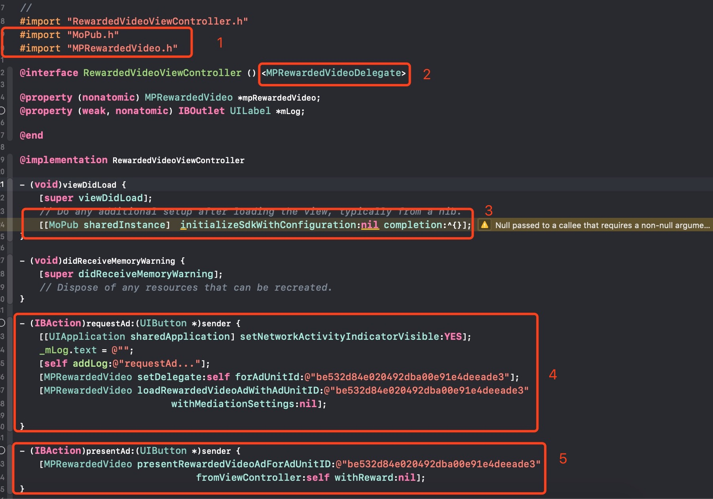
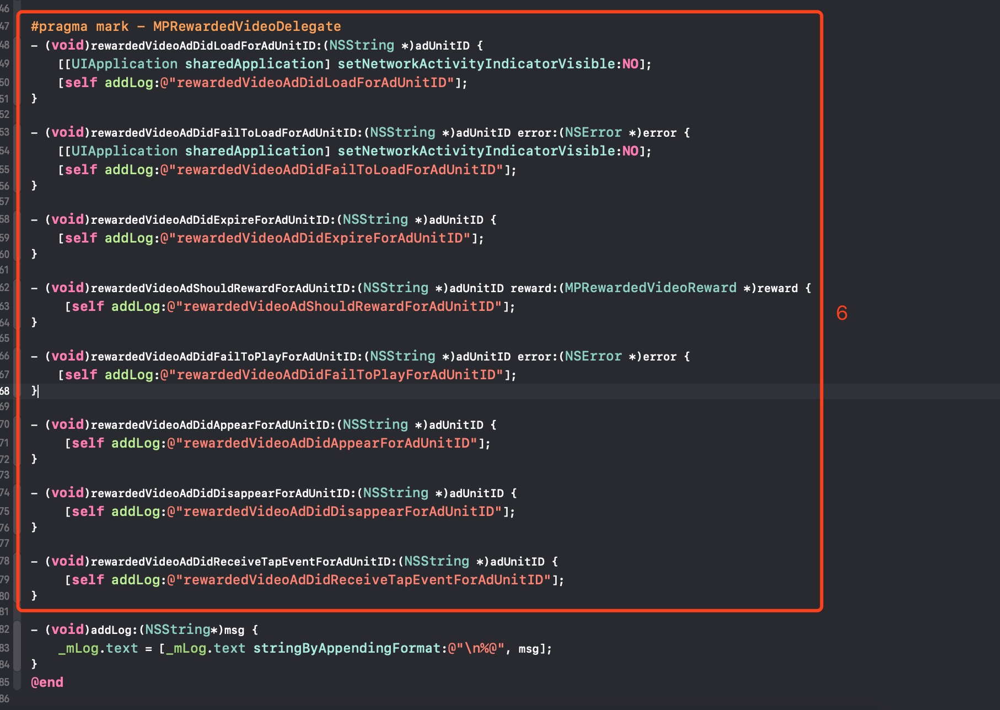

# 目录

- [目录](#%E7%9B%AE%E5%BD%95)
- [1. 在可玩广告平台申请应用ID及广告位ID](#1-%E5%9C%A8%E5%8F%AF%E7%8E%A9%E5%B9%BF%E5%91%8A%E5%B9%B3%E5%8F%B0%E7%94%B3%E8%AF%B7%E5%BA%94%E7%94%A8id%E5%8F%8A%E5%B9%BF%E5%91%8A%E4%BD%8Did)
  - [1.1 进入“应用管理”页面，点击添加“添加应用”按钮](#11-%E8%BF%9B%E5%85%A5%E5%BA%94%E7%94%A8%E7%AE%A1%E7%90%86%E9%A1%B5%E9%9D%A2%E7%82%B9%E5%87%BB%E6%B7%BB%E5%8A%A0%E6%B7%BB%E5%8A%A0%E5%BA%94%E7%94%A8%E6%8C%89%E9%92%AE)
  - [1.2 填写相关信息，点击“保存”按钮，返回应用管理列表页](#12-%E5%A1%AB%E5%86%99%E7%9B%B8%E5%85%B3%E4%BF%A1%E6%81%AF%E7%82%B9%E5%87%BB%E4%BF%9D%E5%AD%98%E6%8C%89%E9%92%AE%E8%BF%94%E5%9B%9E%E5%BA%94%E7%94%A8%E7%AE%A1%E7%90%86%E5%88%97%E8%A1%A8%E9%A1%B5)
  - [1.3 在应用管理列表页，获取应用的ID](#13-%E5%9C%A8%E5%BA%94%E7%94%A8%E7%AE%A1%E7%90%86%E5%88%97%E8%A1%A8%E9%A1%B5%E8%8E%B7%E5%8F%96%E5%BA%94%E7%94%A8%E7%9A%84id)
  - [1.4 点击应用右侧的“创建广告位”按钮或者进入“广告位管理页面”点击“添加广告位”按钮](#14-%E7%82%B9%E5%87%BB%E5%BA%94%E7%94%A8%E5%8F%B3%E4%BE%A7%E7%9A%84%E5%88%9B%E5%BB%BA%E5%B9%BF%E5%91%8A%E4%BD%8D%E6%8C%89%E9%92%AE%E6%88%96%E8%80%85%E8%BF%9B%E5%85%A5%E5%B9%BF%E5%91%8A%E4%BD%8D%E7%AE%A1%E7%90%86%E9%A1%B5%E9%9D%A2%E7%82%B9%E5%87%BB%E6%B7%BB%E5%8A%A0%E5%B9%BF%E5%91%8A%E4%BD%8D%E6%8C%89%E9%92%AE)
  - [1.5填写相关信息，点击“保存”按钮，返回广告位管理列表页](#15%E5%A1%AB%E5%86%99%E7%9B%B8%E5%85%B3%E4%BF%A1%E6%81%AF%E7%82%B9%E5%87%BB%E4%BF%9D%E5%AD%98%E6%8C%89%E9%92%AE%E8%BF%94%E5%9B%9E%E5%B9%BF%E5%91%8A%E4%BD%8D%E7%AE%A1%E7%90%86%E5%88%97%E8%A1%A8%E9%A1%B5)
  - [1.6在广告位管理列表页，获取广告位的ID](#16%E5%9C%A8%E5%B9%BF%E5%91%8A%E4%BD%8D%E7%AE%A1%E7%90%86%E5%88%97%E8%A1%A8%E9%A1%B5%E8%8E%B7%E5%8F%96%E5%B9%BF%E5%91%8A%E4%BD%8D%E7%9A%84id)
- [2. 添加 MoPub-AtmosplayAds-Adapters SDK，步骤如下：](#2-添加-MoPub-AtmosplayAds-Adapters-SDK，步骤如下：)
  - [2.1 在 Podfile 文件中添加依赖项](#21-在-Podfile-文件中添加依赖项)
  - [2.2 在终端运行以下命令](#22-在终端运行以下命令)
- [3. 在MoPub平台为可玩广告配置广告位](#3-%E5%9C%A8mopub%E5%B9%B3%E5%8F%B0%E4%B8%BA%E5%8F%AF%E7%8E%A9%E5%B9%BF%E5%91%8A%E9%85%8D%E7%BD%AE%E5%B9%BF%E5%91%8A%E4%BD%8D)
  - [3.1 为可玩广告新建广告位](#31-%E4%B8%BA%E5%8F%AF%E7%8E%A9%E5%B9%BF%E5%91%8A%E6%96%B0%E5%BB%BA%E5%B9%BF%E5%91%8A%E4%BD%8D)
  - [3.2 获取已有广告位的ID](#32-%E8%8E%B7%E5%8F%96%E5%B7%B2%E6%9C%89%E5%B9%BF%E5%91%8A%E4%BD%8D%E7%9A%84id)
- [4. 在MoPub平台增加可玩广告为新的广告源](#4-%E5%9C%A8mopub%E5%B9%B3%E5%8F%B0%E5%A2%9E%E5%8A%A0%E5%8F%AF%E7%8E%A9%E5%B9%BF%E5%91%8A%E4%B8%BA%E6%96%B0%E7%9A%84%E5%B9%BF%E5%91%8A%E6%BA%90)
  - [4.1 进入“Networks”页面，点击“New network”按钮](#41-%E8%BF%9B%E5%85%A5networks%E9%A1%B5%E9%9D%A2%E7%82%B9%E5%87%BBnew-network%E6%8C%89%E9%92%AE)
  - [4.2 点击“Custom SDK network“链接](#42-%E7%82%B9%E5%87%BBcustom-sdk-network%E9%93%BE%E6%8E%A5)
  - [4.3 添加可玩广告平台名称为ZPLAY Ads，并且在步骤3中申请的广告位中配置可玩广告（图示1和图示2）。](#43-%E6%B7%BB%E5%8A%A0%E5%8F%AF%E7%8E%A9%E5%B9%BF%E5%91%8A%E5%B9%B3%E5%8F%B0%E5%90%8D%E7%A7%B0%E4%B8%BAzplay-ads%E5%B9%B6%E4%B8%94%E5%9C%A8%E6%AD%A5%E9%AA%A43%E4%B8%AD%E7%94%B3%E8%AF%B7%E7%9A%84%E5%B9%BF%E5%91%8A%E4%BD%8D%E4%B8%AD%E9%85%8D%E7%BD%AE%E5%8F%AF%E7%8E%A9%E5%B9%BF%E5%91%8A%E5%9B%BE%E7%A4%BA1%E5%92%8C%E5%9B%BE%E7%A4%BA2)
- [5. 在MoPub平台打开可玩广告广告源](#5-%E5%9C%A8mopub%E5%B9%B3%E5%8F%B0%E6%89%93%E5%BC%80%E5%8F%AF%E7%8E%A9%E5%B9%BF%E5%91%8A%E5%B9%BF%E5%91%8A%E6%BA%90)
  - [5.1 进入“Segments”页面，点击“Global Segment”链接](#51-%E8%BF%9B%E5%85%A5segments%E9%A1%B5%E9%9D%A2%E7%82%B9%E5%87%BBglobal-segment%E9%93%BE%E6%8E%A5)
  - [5.2 找到接入可玩广告的应用（如示例中PlayableMopubAd）及广告位（示例中的ZPLAY Ads Ad Unit ID），打开可玩广告广告源（图中的turn on所示的按钮）](#52-%E6%89%BE%E5%88%B0%E6%8E%A5%E5%85%A5%E5%8F%AF%E7%8E%A9%E5%B9%BF%E5%91%8A%E7%9A%84%E5%BA%94%E7%94%A8%E5%A6%82%E7%A4%BA%E4%BE%8B%E4%B8%ADplayablemopubad%E5%8F%8A%E5%B9%BF%E5%91%8A%E4%BD%8D%E7%A4%BA%E4%BE%8B%E4%B8%AD%E7%9A%84zplay-ads-ad-unit-id%E6%89%93%E5%BC%80%E5%8F%AF%E7%8E%A9%E5%B9%BF%E5%91%8A%E5%B9%BF%E5%91%8A%E6%BA%90%E5%9B%BE%E4%B8%AD%E7%9A%84turn-on%E6%89%80%E7%A4%BA%E7%9A%84%E6%8C%89%E9%92%AE)
- [6. 确认可玩广告配置成功](#6-%E7%A1%AE%E8%AE%A4%E5%8F%AF%E7%8E%A9%E5%B9%BF%E5%91%8A%E9%85%8D%E7%BD%AE%E6%88%90%E5%8A%9F)
- [7. 在工程中使用MoPub请求可玩广告](#7-%E5%9C%A8%E5%B7%A5%E7%A8%8B%E4%B8%AD%E4%BD%BF%E7%94%A8mopub%E8%AF%B7%E6%B1%82%E5%8F%AF%E7%8E%A9%E5%B9%BF%E5%91%8A)
- [8. 示例](#8-%E7%A4%BA%E4%BE%8B)
- [9. 测试](#9-测试)

## 1. 在可玩广告平台申请应用ID及广告位ID

### 1.1 进入“[应用管理](https://sellers.zplayads.com/#/app/appList/)”页面，点击添加“添加应用”按钮


### 1.2 填写相关信息，点击“保存”按钮，返回应用管理列表页 

a. 若您的应用已上线，可直接填入应用下载地址获取应用信息


b. 若您的应用未上线，您需手动填写应用信息


### 1.3 在应用管理列表页，获取应用的ID


### 1.4 点击应用右侧的“创建广告位”按钮或者进入“[广告位管理页面](https://sellers.zplayads.com/#/ad/placeList/)”点击“添加广告位”按钮


### 1.5填写相关信息，点击“保存”按钮，返回广告位管理列表页


### 1.6在广告位管理列表页，获取广告位的ID


> 注：您在测试中可使用如下ID进行测试，测试ID不会产生收益，应用上线时请使用您申请的正式ID。

## 2. 添加 MoPub-AtmosplayAds-Adapters SDK，步骤如下：

了解如何使用[Cocoapods](https://guides.cocoapods.org/using/getting-started.html)

### 2.1 在 Podfile 文件中添加依赖项

```ruby
pod 'MoPub-AtmosplayAds-Adapters'
```
### 2.2 在终端运行以下命令
```ruby
$ pod repo update
$ pod install
```

在安装完成后，关闭Xcode，在工程根目录下打开.xcworkspace文件：


**注意：本示例使用CocoaPods集成ZPLAY Ads的，如果需要手动集成ZPLAY Ads请[参考](https://github.com/zplayads/PlayableAdsDemo-iOS/blob/master/README-CN.md#22-%E6%89%8B%E5%8A%A8%E9%9B%86%E6%88%90playableads-sdk).**


## 3. 在[MoPub平台](https://app.mopub.com/apps)为可玩广告配置广告位

### 3.1 为可玩广告新建广告位

- 进入应用，点击“New add unit”按钮


- 创建广告位，请注意format应该为Rewarded video或Fullscreen，点击“Save”按钮,此处以Rewarded video为例

 

- 获取新创建广告位的Ad unit ID


### 3.2 获取已有广告位的ID

- 选择应用，进入广告位列表，选择要接入的广告位，点击进入。点击“Edit ad unit”按钮，点击“View code integration”按钮


- 获取广告位的Ad unit ID


## 4. 在[MoPub平台](https://app.mopub.com/networks)增加可玩广告为新的广告源

### 4.1 进入“Networks”页面，点击“New network”按钮


### 4.2 点击“Custom SDK network“链接


### 4.3 添加可玩广告平台名称为ZPLAY Ads，并且在步骤3中申请的广告位中配置可玩广告（图示1和图示2）。


- 请在上图示1的位置添加如下信息：

```objective-c
MPZPLAYAdsRewardedVideoCustomEvent
```

**注意：图示1为适配器的文件名(不带后缀)，可以按个人需求更改为其它名字，请保证图示1填写的内容与项目中适配器的文件名(不带后缀)一致。**

- 请在图示2的位置添加在可玩广告平台申请的广告位信息，格式如下：

```objective-v
{
    "APPID": "A650AB0D-7BFC-2A81-3066-D3170947C3DA",
    "AdUnitId": "BAE5DAAC-04A2-2591-D5B0-38FA846E45E7"
}
```

注意：将A650AB0D-7BFC-2A81-3066-D3170947C3DA替换成您在可玩广告平台申请的APPID（步骤1.3），将BAE5DAAC-04A2-2591-D5B0-38FA846E45E7替换成您在可玩广告平台申请的AdUnitId（步骤1.6）。

## 5. 在[MoPub平台](https://app.mopub.com/segments)打开可玩广告广告源

### 5.1 进入“Segments”页面，点击“Global Segment”链接


### 5.2 找到接入可玩广告的应用（如示例中PlayableMopubAd）及广告位（示例中的ZPLAY Ads Ad Unit ID），打开可玩广告广告源（图中的turn on所示的按钮）


## 6. 确认可玩广告配置成功

进入5.2 中已经打开可玩广告源的广告位管理页面，如果成功配置，则会在ad sources列表中会显示如下信息。如果未显示，请参照以上步骤进行检查。


## 7. 在工程中使用MoPub请求可玩广告

配置信息如下：



- 图示1：导入MoPub需要的文件
- 图示2：添加MoPub广告回调的声明
- 图示3：初始化MoPub SDK
- 图示4：请求广告，请正确填入在MoPub平台申请的广告位ID（详见第4步）
- 图示5：展示广告，请正确填入在MoPub平台申请的广告位ID（详见第4步）
- 图示6：添加MoPub广告回调接口

## 8. 示例

点击查看[Demo](https://github.com/zplayads/PlayableMopubAdDemo-iOS)

> 注意：执行demo前，请在终端命令行进入工程根目录下执行```pod install --repo-update```。

## 9. 测试

您在测试中可使用如下ID进行测试，测试ID不会产生收益，应用上线时请使用您申请的正式ID。

| 操作系统 | 广告形式 | App_ID                               | Ad_Unit_id                           |
| ---- | ---- | ------------------------------------ | ------------------------------------ |
| iOS  | 激励视频 | A650AB0D-7BFC-2A81-3066-D3170947C3DA | BAE5DAAC-04A2-2591-D5B0-38FA846E45E7 |
| iOS  | 插屏   | A650AB0D-7BFC-2A81-3066-D3170947C3DA | 0868EBC0-7768-40CA-4226-F9924221C8EB |
| iOS  | 横幅   | A650AB0D-7BFC-2A81-3066-D3170947C3DA | A49521F3-339D-994F-FC80-F9C4170AA0CF |
