## 目录
1. 在可玩广告平台申请应用ID及广告位ID
2. 添加MoPub SDK和ZPLAY Ads SDK
3. 将以下文件添加到工程里面 
4. 在MoPub平台为可玩广告配置广告位 
5. 在MoPub平台增加可玩广告为新的广告源 
6. 在MoPub平台打开可玩广告广告源 
7. 确认可玩广告配置成功 
8. 在工程中使用MoPub请求可玩广告 
9. 调试
10. 示例

---

## 1. 在可玩广告平台申请应用ID及广告位ID
#### 1.1 进入“应用管理”页面，点击添加“添加应用”按钮
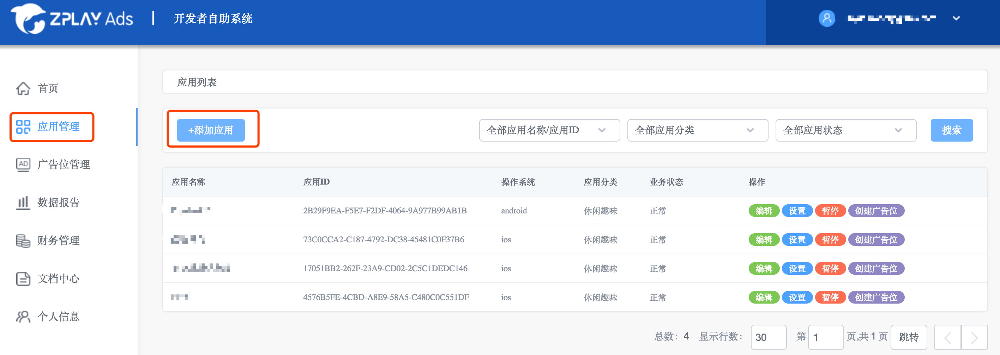

#### 1.2 填写相关信息，点击“添加”按钮，返回应用管理列表页 
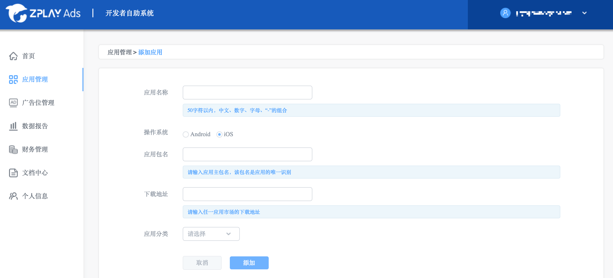

#### 1.3 在应用管理列表页，获取应用的ID
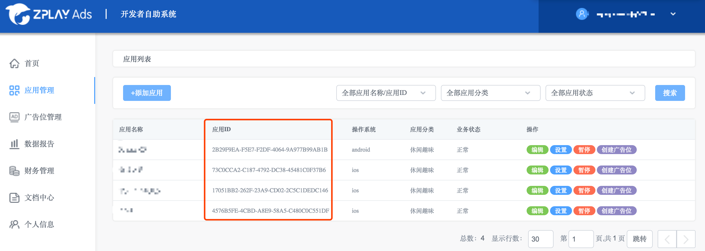

#### 1.4 点击应用右侧的“创建广告位”按钮或者进入“广告位管理页面”点击“添加广告位”按钮
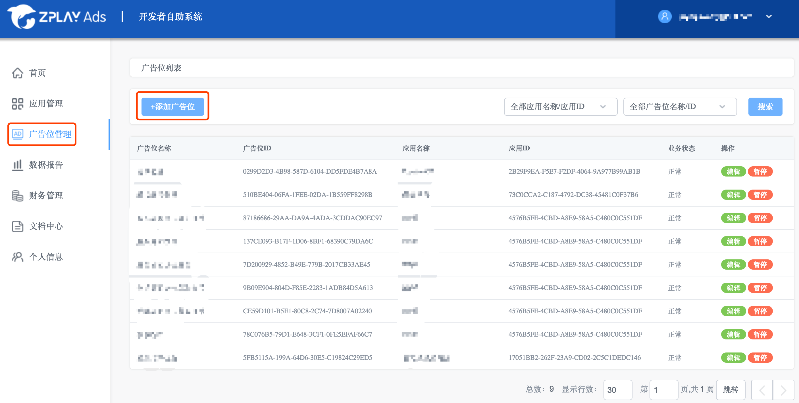

#### 1.5填写相关信息，点击“添加”按钮，返回广告位管理列表页
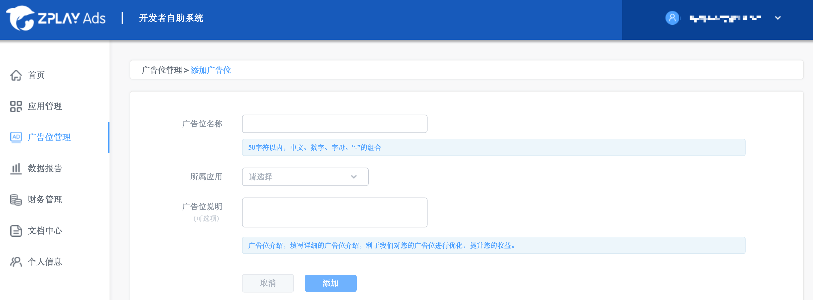

#### 1.6在广告位管理列表页，获取广告位的ID
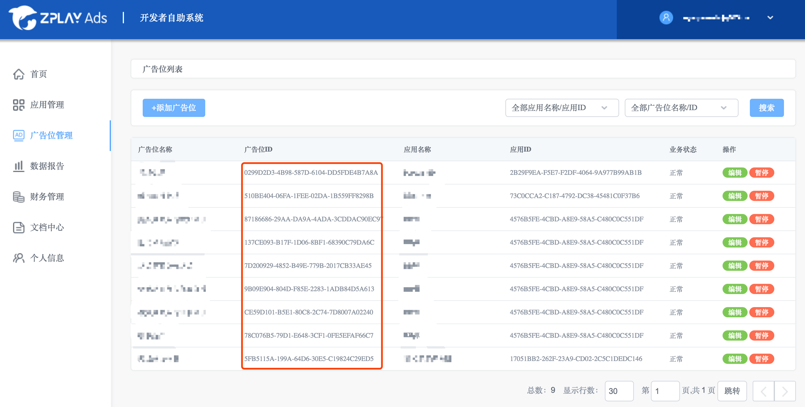

注：您在测试中可使用如下id进行测试，测试id不会产生收益，应用上线时请使用您申请的正式id。

|操作系统|广告形式|  App_ID  |  Ad_Unit_id|
|--------|----|----------|------------|
|iOS|激励视频|A650AB0D-7BFC-2A81-3066-D3170947C3DA|BAE5DAAC-04A2-2591-D5B0-38FA846E45E7|
|iOS|插屏|A650AB0D-7BFC-2A81-3066-D3170947C3DA|0868EBC0-7768-40CA-4226-F9924221C8EB|

## 2. 添加MoPub SDK和ZPLAY Ads SDK，步骤如下：

了解如何使用[Cocoapods](https://guides.cocoapods.org/using/getting-started.html)

#### 2.1 在Podfile文件中添加依赖项
```
pod “mopub-ios-sdk”
pod “PlayableAds”, "~>2.0.5"
```
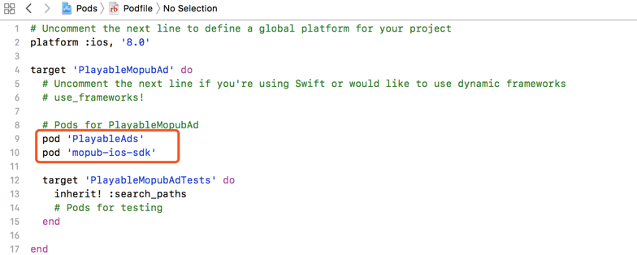

#### 2.2 在终端命令里面执行pod install
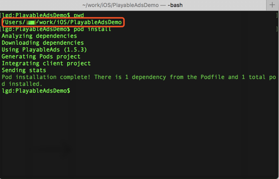

在安装完成后，关闭xcode，在工程根目录下打开.xcworkspace文件：

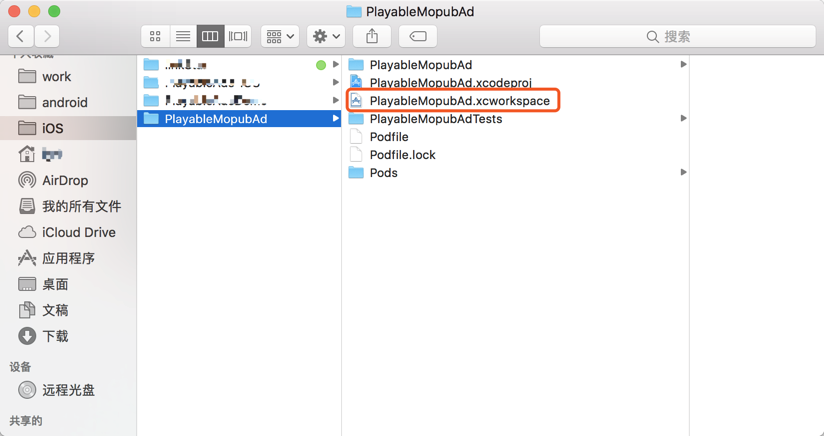

**注意：本示例使用CocoaPods集成ZPLAY Ads的，如果需要手动集成ZPLAY Ads请[参考](https://github.com/zplayads/PlayableAdsDemo-iOS/blob/master/README-CN.md#22-%E6%89%8B%E5%8A%A8%E9%9B%86%E6%88%90playableads-sdk).**

## 3. 将以下文件添加到工程里面

[MPZPLAYAdsRewardedVideoCustomEvent.h](./PlayableMopubAd/MPZPLAYAdsRewardedVideoCustomEvent.h)

[MPZPLAYAdsRewardedVideoCustomEvent.m](./PlayableMopubAd/MPZPLAYAdsRewardedVideoCustomEvent.m)

## 4. 在MoPub平台为可玩广告配置广告位
#### 4.1 为可玩广告新建广告位
- 进入应用，点击“New add unit”按钮

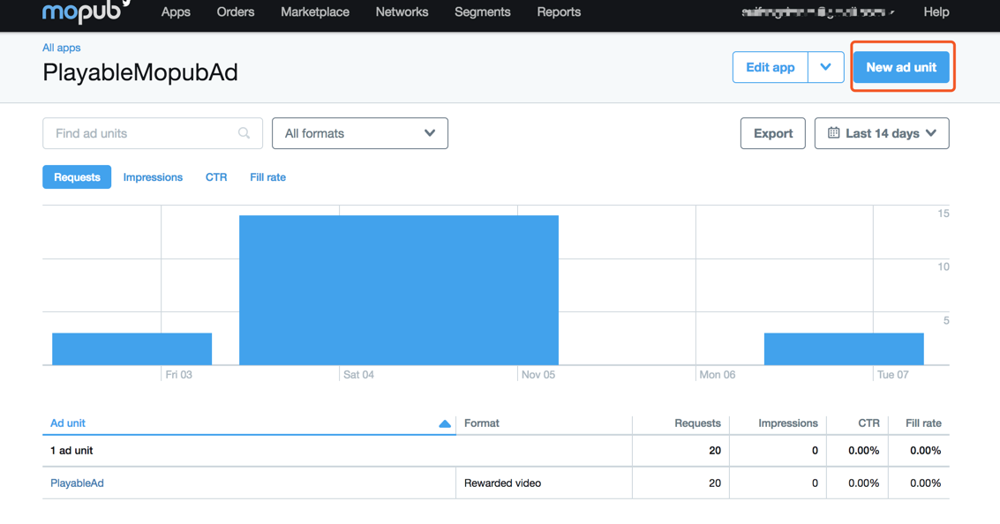

- 创建广告位，请注意format应该为Rewarded video，点击“Save”按钮

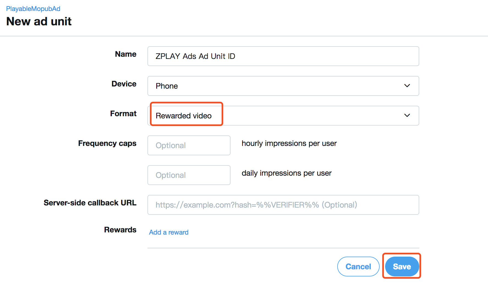 

- 获取新创建广告位的Ad unit ID

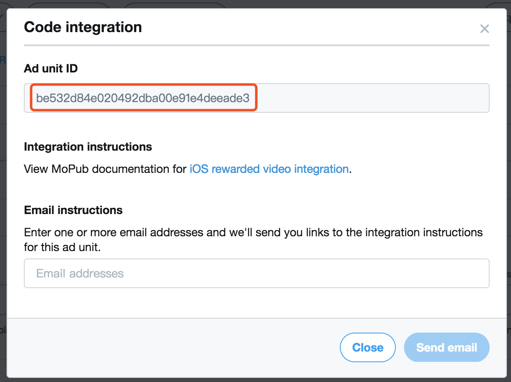

#### 4.2 获取已有广告位的ID
- 选择应用，进入广告位列表，选择要接入的广告位，点击进入。点击“Edit ad unit”按钮，点击“View code integration”按钮

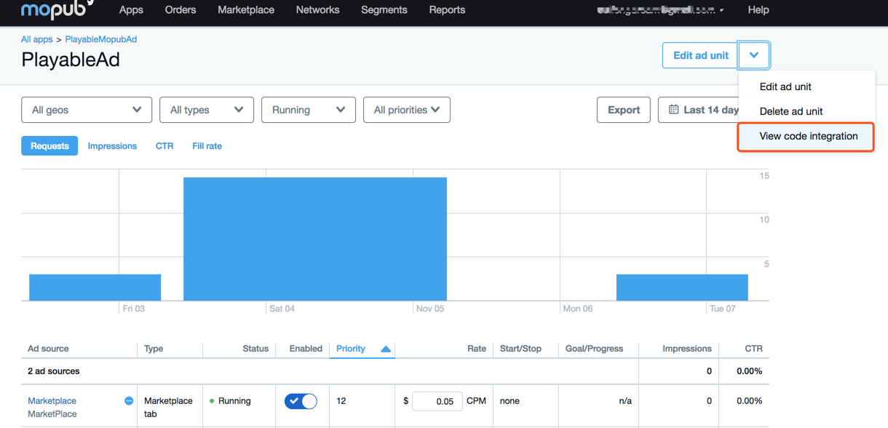

- 获取广告位的Ad unit ID

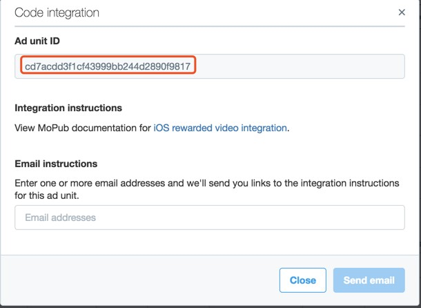

## 5. 在MoPub平台增加可玩广告为新的广告源
#### 5.1 进入“Networks”页面，点击“New network”按钮
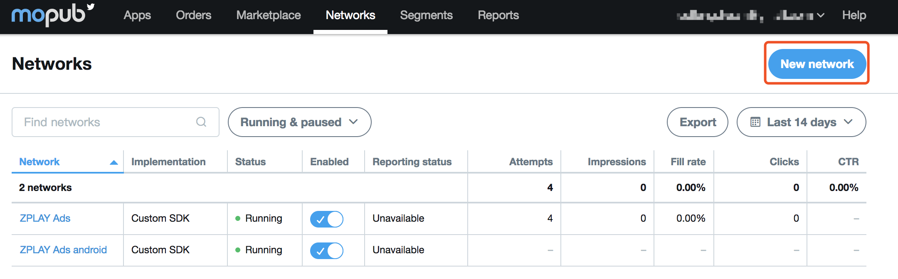

#### 5.2 点击“Custom SDK network“链接
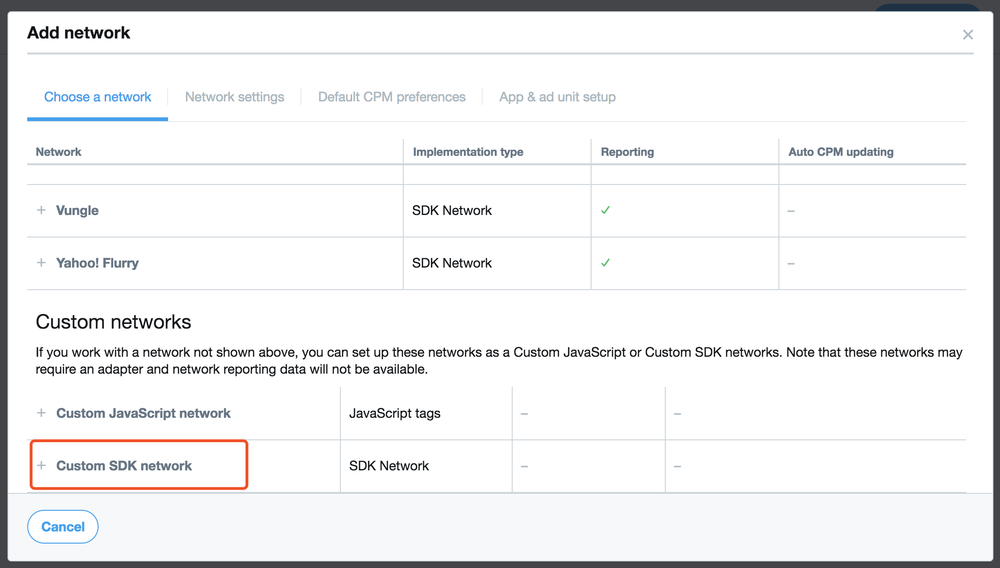

#### 5.3 添加可玩广告平台名称为ZPLAY Ads，并且在步骤3中申请的广告位中配置可玩广告（图示1和图示2）。

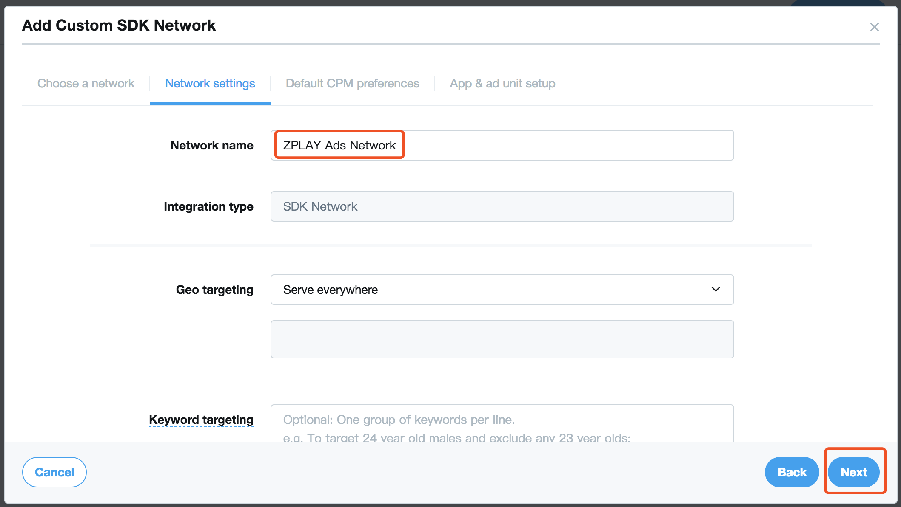
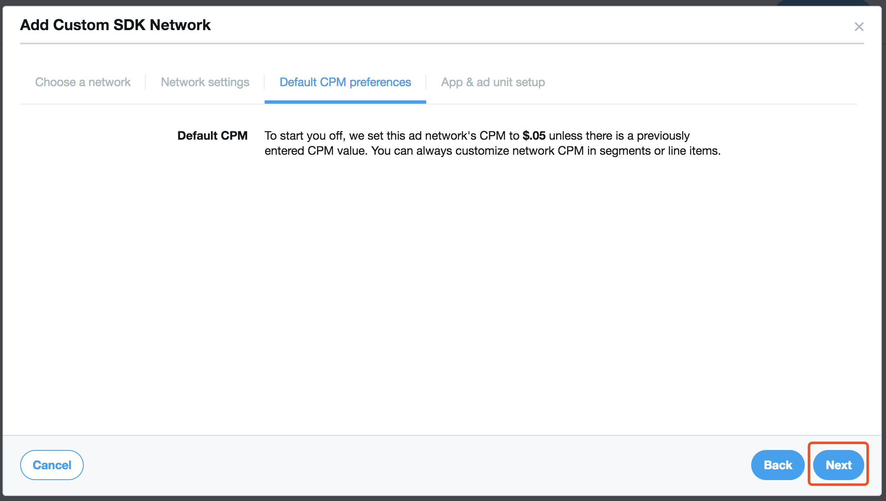
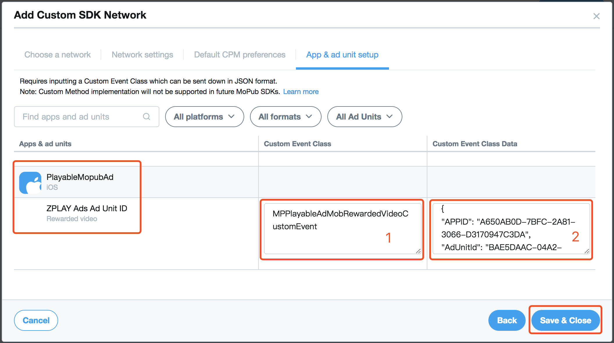

- 请在图示1的位置添加如下信息：
```
MPZPLAYAdsRewardedVideoCustomEvent
```
**注意：图示1为适配器的文件名(不带后缀)，可以按个人需求更改为其它名字，请保证图示1填写的内容与项目中适配器的文件名(不带后缀)一致。**

- 请在图示2的位置添加在可玩广告平台申请的广告位信息，格式如下：
```
{
	"APPID": "A650AB0D-7BFC-2A81-3066-D3170947C3DA",
	"AdUnitId": "BAE5DAAC-04A2-2591-D5B0-38FA846E45E7"
}
```
注意：将iOSDemoApp替换成您在可玩广告平台申请的APPID（步骤1.3），将iOSDemoAdUnit替换成您在可玩广告平台申请的AdUnitId（步骤1.6）。

## 6. 在MoPub平台打开可玩广告广告源
#### 6.1 进入“Segments”页面，点击“Global Segment”链接
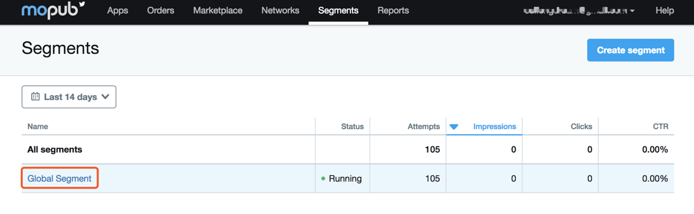

#### 6.2 找到接入可玩广告的应用（如示例中PlayableMopubAd）及广告位（示例中的ZPLAY Ads Ad Unit ID），打开可玩广告广告源（图中的turn on所示的按钮）


## 7. 确认可玩广告配置成功
进入6.2 中已经打开可玩广告源的广告位管理页面，如果成功配置，则会在ad sources列表中会显示如下信息。如果未显示，请参照以上步骤进行检查。

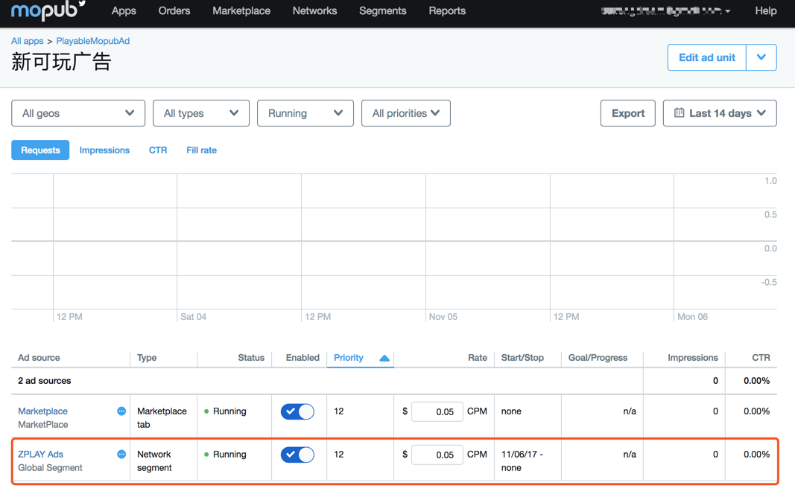

## 8. 在工程中使用MoPub请求可玩广告

配置信息如下：

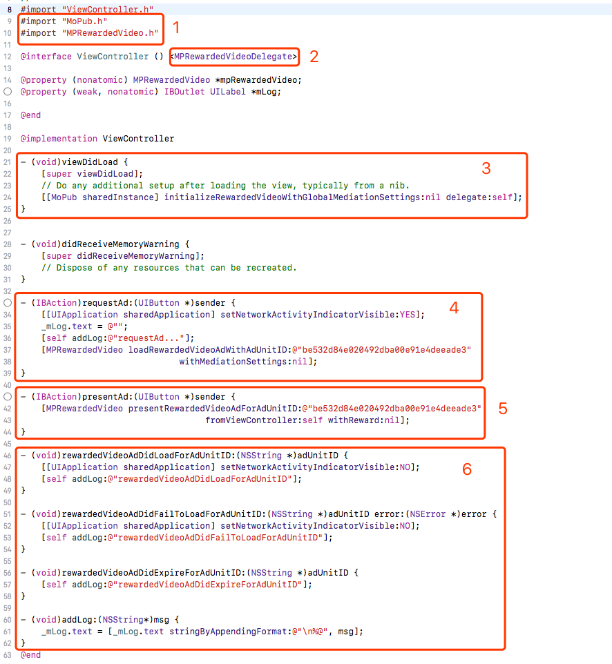

- 图示1：导入MoPub需要的文件
- 图示2：添加MoPub广告回调的声明
- 图示3：初始化MoPub SDK
- 图示4：请求广告，请正确填入在MoPub平台申请的广告位ID（详见第4步）
- 图示5：展示广告，请正确填入在MoPub平台申请的广告位ID（详见第4步）
- 图示6：添加MoPub广告回调接口

## 9. 示例
点击查看[Demo](https://github.com/zplayads/PlayableMopubAdDemo-iOS)

注意：执行demo前，请在终端命令行进入工程根目录下执行pod install。
