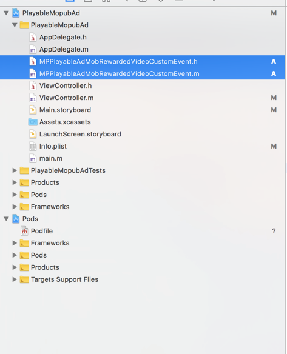
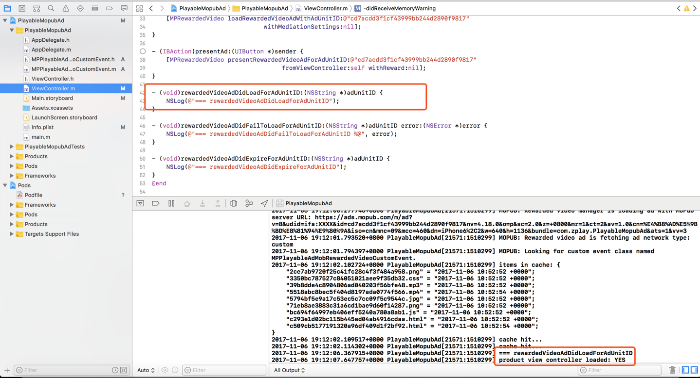

## Directory
1. Apply for app ID and ad unit ID on ZPLAY Ads platform
2. Add Mopub SDK and PlayableAds SDK
3. Add the following files into project
4. Set ad unit for ZPLAY Ads on MoPub
5. Add ZPLAY Ads as a new network on MoPub
6. Turn on ZPLAY Ads network on MoPub
7. Confirm the configuration of ZPLAY Ads
8. Use MoPub to request ZPLAY Ads in project
9. Debugging
10. Sample

---

## 1. Apply for app ID and ad unit ID on ZPLAY Ads platform
#### 1.1 Click *ADD NEW APP* button in Application Management page


#### 1.2 Fill in app information, and click *ADD* button, then go back to Application Management


#### 1.3 Obtain your app ID in Application Management page


#### 1.4 Click *Add New AdUnit* button in app list, or you are also available to do this in AdUnit Management page


#### 1.5 Fill in adunit information, and click *ADD* button, then go back to AdUnit Management


#### 1.6 Obtain your adunit ID in AdUnit Management page


Note: You are available to use the following ID when testing(not charge). Please switch to the ID you applied in production mode.

|OS|  App_ID  |  Ad_Unit_id|
|--------|----------|------------|
|iOS|A650AB0D-7BFC-2A81-3066-D3170947C3DA|BAE5DAAC-04A2-2591-D5B0-38FA846E45E7|

## 2. Add Mopub SDK and PlayableAds SDK as below:

How to use [Cocoapods](https://guides.cocoapods.org/using/getting-started.html)

#### 2.1 Add dependencies in Podfile file
```
pod “mopub-ios-sdk”
pod “PlayableAds”, "~>2.0.2"
```


#### 2.2 Execute pod install in Terminal


Turn off xcode after installation, and open .xcworkspace file in the root of project:


## 3. Add the following files into project

MPPlayableAdMobRewardedVideoCustomEvent.h

MPPlayableAdMobRewardedVideoCustomEvent.m



## 4. Set ad unit for ZPLAY Ads on MoPub
#### 4.1 Create new adunit for ZPLAY Ads
- Choose your app, click *New ad unit* button


- Choose Rewarded video when creating adunit, then click *Save* button

 

- Obtain the new adunit ID


#### 4.2 Obtain the existed adunit ID
- Choose your app and enter adunit list.Click the adunit, and click *Edit an unit*, then choose *View code integration* button.


- Obtain the adunit ID


## 5. Add ZPLAY Ads as a new network on MoPub
#### 5.1 Open Networks page, click *Add a Network* button


#### 5.2 Click *Custom Native Network* link


#### 5.3 Set the title as ZPLAY Ads（image 1), and configure ZPLAY Ads in the adunits which were applied in step 3(image 2 and 3).


- Add the followings to image 2:
```
MPPlayableAdMobRewardedVideoCustomEvent
```

- Add the adunits you applied on ZPLAY Ads to image 3 as the following format:
```
{
	"APPID": "iOSDemoApp",
	"AdUnitId": "iOSDemoAdUnit"
}
```
Note: If necessary, please view step 1.3 to know how to change iosDemoApp to the APPID you applied on ZPLAY Ads, and view step 1.6 to find the way to change iosDemoAdUnit to AdUnitId applied on ZPLAY Ads.

## 6. Turn on ZPLAY Ads network on MoPub
#### 6.1  Open Segments page, and click *Global Segment* link


#### 6.2 Find the app and adunit which have been integrated to ZPLAY Ads（as the MediationMopub in screenshot below), turn on ZPLAY Ads network(as the turn on button in screenshot below).


## 7. Confirm the configuration of ZPLAY Ads
After step 6.2, the ZPLAY Ads network has been available already. Enter AdUnit Management page, the ad sources list will be shown as below if configuration is successful. If not, please check according to the previous steps.


## 8. Use MoPub to request ZPLAY Ads in project

Here are the configurations:


- Image 1: Import MoPub-needed files
- Image 2: Add the statement of MoPub callback
- Image 3: Initialize MoPub SDK
- Image 4: Request ad, please fill in the adunit ID applied on MoPub correctly(view step 4 for details).
- Image 5: Show ad, please fill in the adunit ID applied on MoPub correctly(view step 4 for details).
- Image 6: Add MoPub callback interface

## 9. Debugging
Execute the operation of image 4 in Step 8 to request ad and view logs.



## 10. Sample
View [Demo](https://github.com/zplayads/PlayableMopubAdDemo-iOS)

Note: Please execute pod install in the root of project in Terminal before operating demo.

